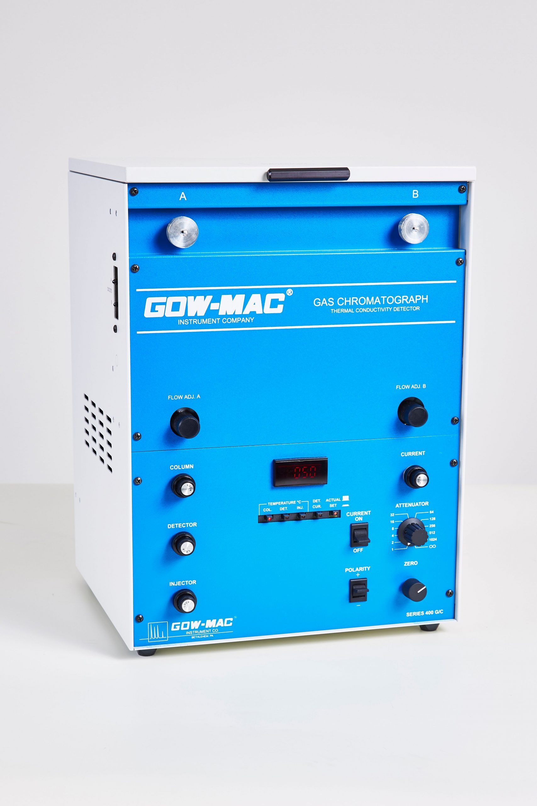

# GOWMAC-400

Published

August 7, 2025

GOWMAC 400

## Description

The GOW-MAC 400 is a compact, isothermal gas chromatograph designed for educational and quality control applications. It features a thermal conductivity detector (TCD) and supports both packed and capillary columns for analyzing a wide range of gaseous compounds. Ideal for teaching chromatography fundamentals, the instrument offers straightforward operation and reliable performance for routine gas analysis.

## Technical Details

| Specification | Value                 |
|---------------|-----------------------|
| Series \#     | 400                   |
| Type          | Gas Chromatograph     |
| Dimensions    | 12”W x 11”D x 16.5” H |
| Weight        | 27lbs                 |
| Power         | 110V/220V             |
| Detector      | TCD                   |
| Gas           | He/H2/N2/Ar           |
| Temp Range    | Ambient to 300°C      |

## Manuals

[GOWMAC 400 Operational Manual](../Instrumentation/Manuals/GOWMAC-Series_400_Rev14_0224.pdf)

### (SOP) Standard Operating Procedure

## Instrument Table

[SI-Table-GOWMAC-400](../Instrumentation/SI-Table-GOWMAC.llms.md)

Back to top
