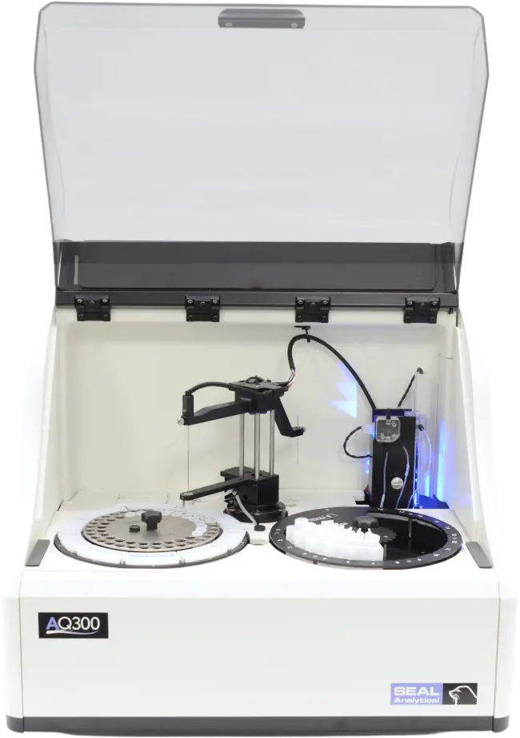

# SEAL AQ 300 Discrete Analyzer

Published

October 8, 2025

SEAL AQ 300 Discrete Analyzer

## Description

The SEAL AQ 300 is a discrete analyzer designed for the automated colorimetric analysis of multiple parameters from a single environmental sample. The instrument utilizes a 10 mm pathlength quartz cuvette for optical measurements, ensuring high reproducibility and low detection limits.

Key operational features include automated standard preparation, dilution of over-range samples, and correction for sample background color via automated blanking. The system is also capable of performing automated sample spiking. Reagent consumption is minimal, with volumes ranging from 20 to 400 μL per test. To prevent cross-contamination, the sample probe is cleaned by a dedicated washer after each aspiration.

## Technical Details

[TABLE]

## Manuals

### (SOP) Standard Operating Procedure

## Instrument Table

[Scientific Instrumentation Table SEAL AQ 300 Discrete Analyzer](../Instrumentation/SI-Table-SEAL-AQ-300-DA.llms.md)

Back to top
