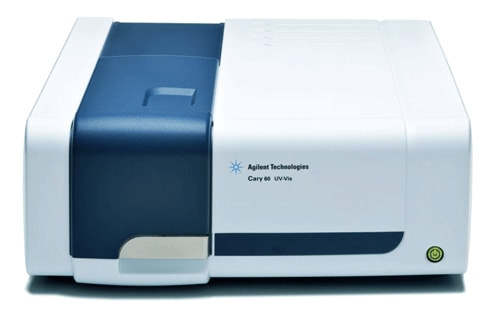
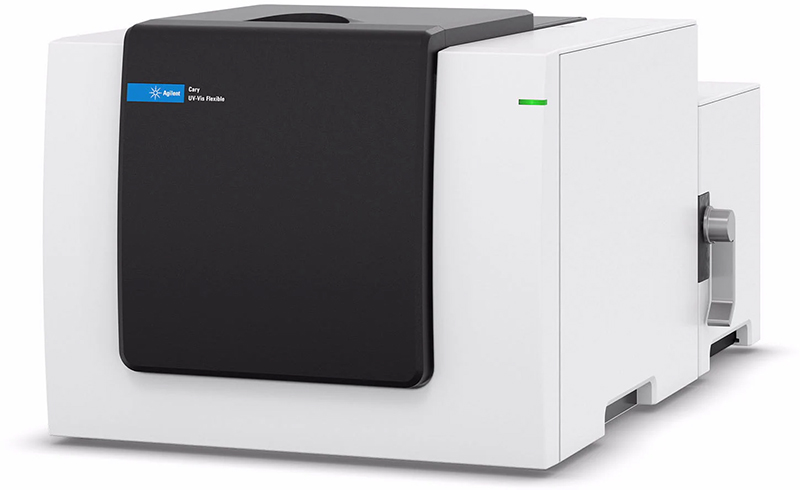
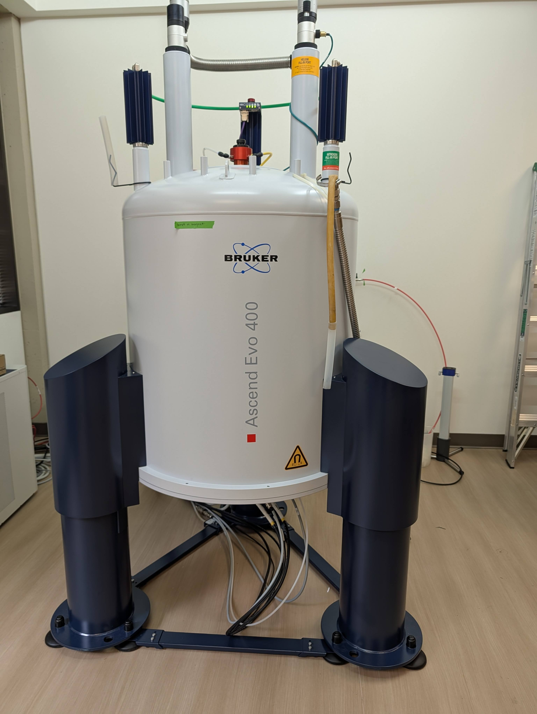
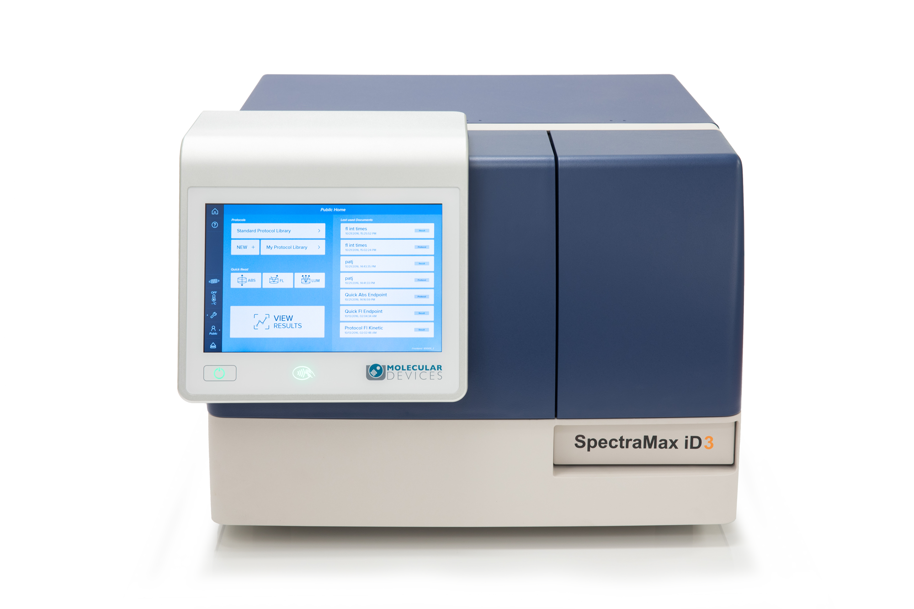
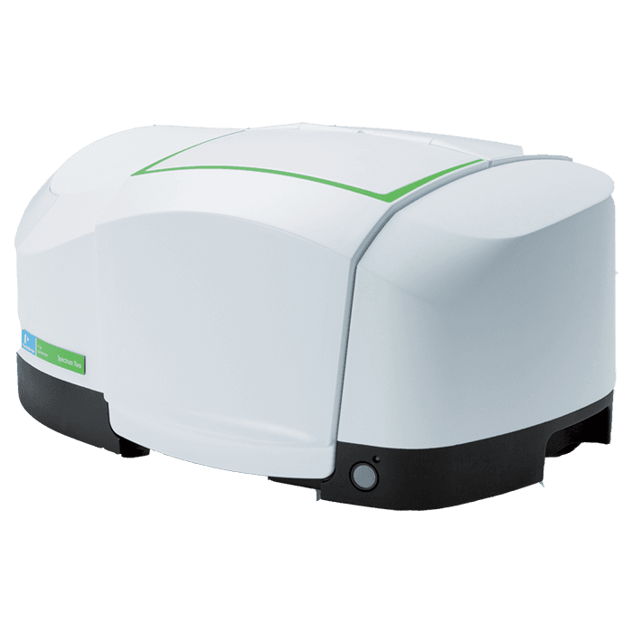
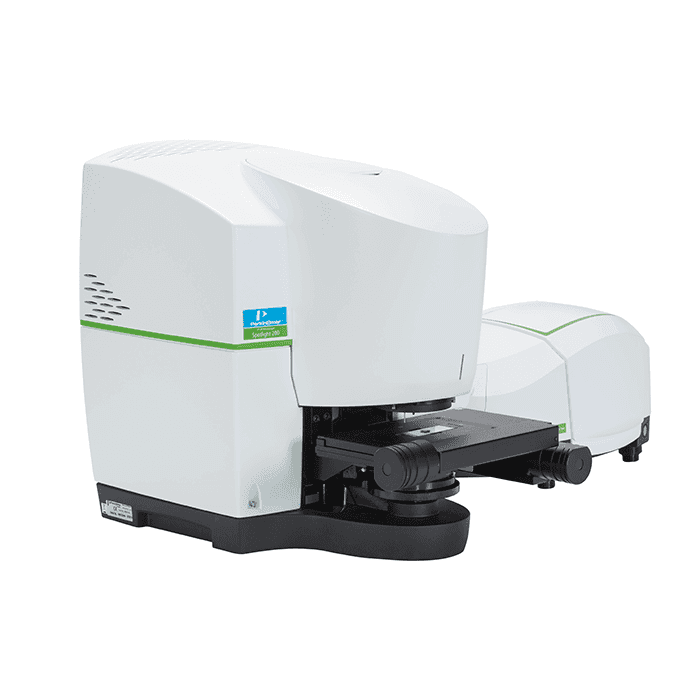
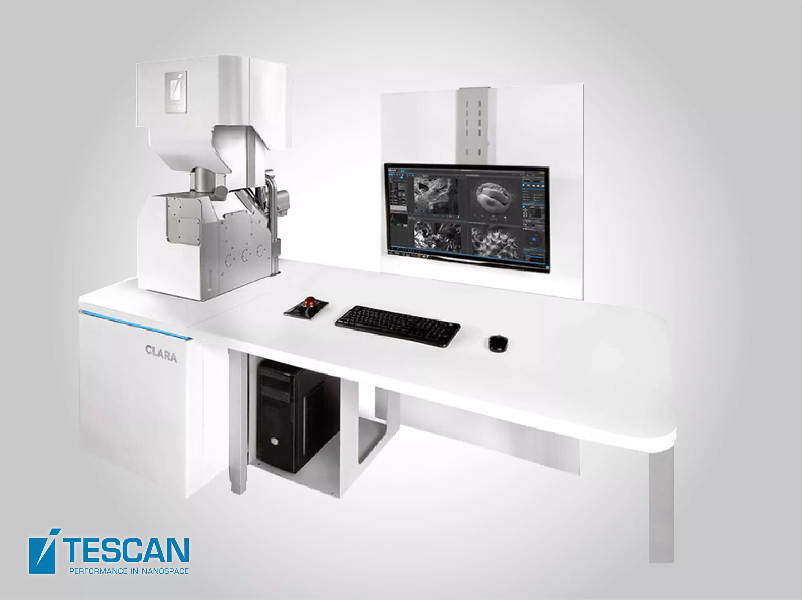

# 2024 Congressionally Directed Spending (CDS), \[NIST\] Instrumentation List

Published

November 14, 2025

## Summary

In 2024, The Evergreen State College in Olympia, Washington, received \$2.135 million through Congressionally Directed Spending (CDS) to acquire advanced laboratory equipment for STEM research and research training programs. This funding was secured by U.S. Senator Patty Murray, formerly Chair of the Senate Appropriations Committee, as part of the fiscal year 2024 Commerce, Justice, Science, and Related Agencies appropriations bill. The National Institute of Standards and Technology (NIST), part of the U.S. Department of Commerce, administers the funds, managing their distribution and compliance, though the funding was directed by Congress.

------------------------------------------------------------------------

Agilent Cary 60 UV-Vis Spectrophotometer

Agilent Cary 3500 UV-Vis Flexible Spectrophotometer

Agilent ICP-MS 7850

Blue Robotics BlueROV2

Bruker Avance NMR 400 MHz Spectrometer

GOWMAC 400

Instron 34SC-1

Molecular Devices SpectraMax iD3 Microplate Reader

PerkinElmer FT-IR Spectrum Two

PerkinElmer FT-IR Microscopy System Spotlight 200 with Spectrum Two

SEAL AQ 300 Discrete Analyzer

TESCAN CLARA SEM

Back to top
